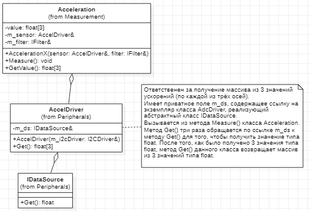

# Architecture 

## Table of contents

1. [Measuring System](#measuringsystem)
1. [GUI](#gui)

## Measuring System 

### Packet "Application"

#### MeasureTask

#### SendTask 

### Packet "Measurement"

#### Acceleration 

#### Temperature 

### Packet "Filter" 

#### Filter

### Packet "Peripheral"

#### AccelDriver

#### UartDriver

### Packet "CPU"

#### Uart 

## GUI 

### Общее описание

Подсистема графического интерфейса ответственна за считывания данных, переданных по последовательному порту, корректное отображение измеренных данных акселерометра и вращение трёхмерной модели. 

Соответственно, программа должна содержать следующие сущности: 
- главное окно; 
- трёхмерная модель объекта; 
- последовательный порт. 

<!--
Use Case-диаграмма для GUI представлена на рисунке ниже: 

Состояния графического интерфейса при коммуникации с пользователем следующие: 
1. Прорисовка графических элементов при загрузке приложения; 
1. 
-->

### MainWindow

### ComPort 

### CircuitBoard 

### Angle3dModel

### Acceleration3dModel

### Exceptions 
