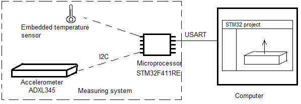

# Design 

## Проектирование графического интерфейса

Примерное графическое представление системы изображено на рисунке снизу: 


<!--
Примерные координаты визуальных объектов: 


-->

## Проектирование архитектуры

## Обзор 

<!--
Из каких модулей будет состоять система, и каким образом будет производиться взаимодействие между ними? 
-->

Система состоит из следующих компонентов:
- Акселерометр **ADXL345**; 
- Гироскоп **L3GD20**;
- Встроенный датчик температуры; 
- **I2C**; 
- **USART**; 
- Программа в виде графического интерфейса.  

На рисунке ниже представлена **схема соединения** составных компонентов: 



**Диаграмма состояний** всей системы (включая *графическую* и *измерительную* подсистему) представлена на рисунке ниже: 


<!--Перепроверить диаграммы компонентов, преобразовать их в диаграммы пакетов (библиотек)-->
**Диаграмма компонентов** для *измерительной части* системы может выглядеть следующим образом: 


**Диаграмма компонентов** для *графической части* системы может выглядеть следующим образом: 


Для корректной работы программы критически важно при проектировании всей системы **устанавливать задержку** на передачу данных с микроконтроллера на компьютер, чтобы программа верхнего уровня не зависала. 

**Настройка конфигурации портов** (контроль чётности, количество стоп бит, количество бит данных, скорость передачи) **производится в** самом **коде** специально под технические требования. 
<!--
Для модуля верхнего уровня: 
```C#

```

Для модуля нижнего уровня: 
```C#

```
-->

Раз в *100 мс* микроконтроллер отсылает данные, измеренные с помощью *гироскопа* и *акселерометра*, на компьютер.

Для того, чтобы было удобнее распаковать на компьютере данные, полученные с микроконтроллера, был придуман **формат пакета**, который будет использоваться конкретно под данную систему: 


Первый бит является служебным и содержит в себе значение для кодирования либо буквы "А", либо буквы "G". 

Получается, что в одной посылке таких пакетов должно быть 6 штук (3 для *акселерометра* и 3 для *гироскопа*). 

*Альтернативный вариант*. 
Можно также сделать 2-байтный пакет: `1 байт` для определения сенсора (если акселерометр, то `0`; если гироскоп, то `1`), `2 байта` для определения оси (если ось `X`, то `00`; если ось `Y`, то `01`; если ось `Z`, то `10`), `9 байт` для данных (от `0` до `512`), `3 байта` для контрольной суммы (сумму байт данных поделить на `64`, получится значение от `0` до `7`, с помощью этого значения можно будет определить целостность полученных данных). 
По-хорошему, ещё должна быть контрольная сумма для обслуживающих данных. 

## Графическая подсистема 

В *графической подсистеме*, наверное, нужно будет реализовывать шаблон **Singleton** (для того, чтобы предотвратить двойное создание таких объектов как *плата* и *COM-порт*) и **Наблюдатель** (для отслеживания наличия изменений *вектора состояния* платы). 

Ещё должна быть осуществлена распаковка *посылки* из пакетов измеренных значений.  

## Измерительная подсистема 

В *измерительной подсистеме* используется операционная система **FreeRTOS** как каркас для всего приложения, и всё приложение, по сути, будет зависеть от архитектуры **FreeRTOS**. 

Спроектиовать, наверное, можно только верхний уровень измерительного модуля (того, который состоит из *акселерометра*, *гироскопа* и *платы*), с которым непосредственно осуществляется работа. 
То есть здесь можно спроектировать то, какие задачи будет выполнять *ОСРВ*, как будут вызываться *UART*, *I2C* и т.д. 

<!--
Насколько я понял, на плате есть пины и названия пинов на самой плате соответствуют пинам, с которыми идёт взаимодействие в программе. 

Микроконтроллер - это master receiver, а гироскоп и акселерометр - это slave transmitter. 

На рисунке ниже представлена принципиальная схема устройства: 
-->
