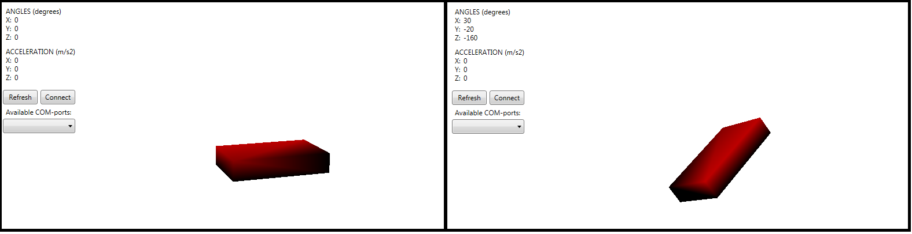

# Stm32Project 

`Stm32Project` is a project that allows you to determine the position of an object in *three-dimensional space* with the transfer of data from MCU to a computer.

This application allows you to rotate a *3D model* on the screen, rotating a *real object* on which an *accelerometer* is attached.



The application is divided into two levels:
- **low level**: measurement  of *relative accelerations* of an object using an accelerometer **ADXL345** (written in `C++` for microcontroller **STM32F411RE**);
- **high level**: visual representation of the received data and rotation of an object (written in `C#` using **WPF**).

Data from *accelerometer* to *microcontroller* is transmitted via **I2C** interface, and from *microcontroller* to *computer* via **UART** interface.

## How to use 

### Prerequisites

- Windows OS; 
- .NET Core 3.1; 
- IAR Embedded Workbench 8.40.2; 
- Microcontroller *STM32F411RE*;
- Accelerometer *ADXL345*; 
- Any text editor (*VS Code*, *Sublime Text*, *Notepad++* etc); 
- Windows command line. 

Dependencies for `Simulation3d`: 
- System.IO.Ports (Version 4.4.0). 

### COM-port configuration

For the program to work correctly, it is critical to **set a delay** for data transmission from the microcontroller to the computer so that the high-level app does not hang.
Because when there is a constant stream of data, at best, the top-level **WPF** app stops responding to anything, but most often the program crashes with an **APPCRASH** exception.

**COM-port configuration** (parity, number of stop bits, number of data bits, baud rate) is made in the code itself depending on technical requirements.

<!--
For Simulation3d (**WPF**): 
```C#

```

For MeasuringSystem (): 
```C#

```
-->

### How to run 

In order to run `Simulation3d` app, write the following command into console: 
```
simulate.cmd
```

In order to run `Simulation3d` without building, write: 
```
simulate.cmd --no-build
```
